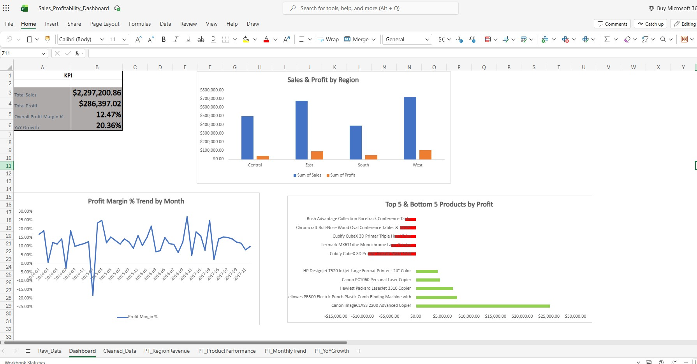

# Sales & Profitability Dashboard
Excel dashboard analyzing sales, profit, and regional performance using the Superstore sales dataset by vivek468 on kaggle. 

## Overview
An interactive Excel dashboard analyzing sales, profit, and regional performance 
using the Superstore dataset. Built to answer: where is the business making 
money, where is it losing money, and what should change?

## Tools Used
Excel Online — Table-based data cleaning, PivotTables, cross-sheet formulas, 
and native charts.

## Dashboard Preview

## Key Insights

**1. Central region underperforms on profit.**
It generates 21.8% of total sales ($501,240) but only 13.9% of total profit 
($39,706) — the weakest profit-to-sales ratio of any region.

**2. A cluster of products are losing money.**
Mostly 3D printers, conference tables, and bookcases sold at steep discounts, 
generating a combined loss of $77,067 — over 25% of the company's total profit.

**3. January 2015 saw a discount-driven profit collapse.**
Margin fell to -18.1% for the month. Nearly every loss-making order that month 
carried a discount of 40% or higher, while profitable orders stayed at 20% 
discount or below — pointing to overly aggressive promotional discounting 
rather than weak demand.

**4. Strong recovery in 2016 and 2017.**
After a slight dip in 2015 (-2.8%), the business rebounded sharply — growing 
29.5% in 2016 and a further 20.4% in 2017, nearly 1.5x total revenue over the 
three-year period.

## Files
- `Sales_Profitability_Dashboard.xlsx` — full workbook with raw data, cleaning 
steps, pivot tables, and dashboard
